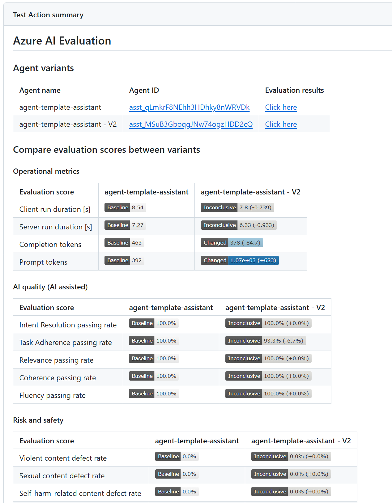

# Azure AI Evaluation GitHub Action

This GitHub Action enables offline evaluation of [Azure AI Agents](https://learn.microsoft.com/en-us/azure/ai-services/agents/) within your CI/CD pipelines. It is designed to streamline the offline evaluation process, allowing you to identify potential issues and make improvements before releasing an update to production.

To use this action, all you need to provide is a data set with test queries and a list of evaluators. This action will invoke your agent(s) with the queries, collect the performance data including latency and token counts, run the evaluations, and generate a summary report.

## Features

- **Agent Evaluation:** Automate pre-production assessment of Azure AI agents in your CI/CD workflow.
- **Built-in Evaluators:** Leverage existing evaluators provided by the [Azure AI Evaluation SDK](https://learn.microsoft.com/en-us/azure/ai-studio/how-to/develop/evaluate-sdk).
- **Statistical Analysis:** Evaluation results include confidence intervals and test for statistical significance to determine if changes are meaningful and not due to random variation.

## Supported AI Evaluators

| Type                     | Evaluator                  |
| ------------------------ | -------------------------- |
| AI Quality (AI assisted) | IntentResolutionEvaluator  |
|                          | TaskAdherenceEvaluator     |
|                          | RelevanceEvaluator         |
|                          | CoherenceEvaluator         |
|                          | FluencyEvaluator           |
| Risk and safety          | ViolenceEvaluator          |
|                          | SexualEvaluator            |
|                          | SelfHarmEvaluator          |
|                          | HateUnfairnessEvaluator    |
|                          | IndirectAttackEvaluator    |
|                          | ProtectedMaterialEvaluator |
|                          | CodeVulnerabilityEvaluator |
| Composite                | ContentSafetyEvaluator     |

For the full list of evaluator scores and their types, see [analysis/evaluator-scores.yaml](analysis/evaluator-scores.yaml).

## Inputs

### Parameters

| Name                              | Required? | Description                                                                                                                                                                                                                                           |
| :-------------------------------- | :-------: | :---------------------------------------------------------------------------------------------------------------------------------------------------------------------------------------------------------------------------------------------------- |
| azure-ai-project-endpoint         |    Yes    | Endpoint of your Azure AI Project                                                                                                                                                                                                                     |
| deployment-name                   |    Yes    | The name of the Azure AI model deployment to use for evaluation                                                                                                                                                                                       |
| data-path                         |    Yes    | Path to the data file that contains the evaluators and input queries for evaluations                                                                                                                                                                  |
| agent-ids                         |    Yes    | ID of the agent(s) to evaluate. If multiple are provided, all agents should be comma-separated and will be evaluated and compared against the baseline with statistical test results                                                                  |
| baseline-agent-id                 |    No     | ID of the baseline agent to compare against when evaluating multiple agents. If not provided, the first agent is used                                                                                                                                 |
| evaluation-result-view            |    No     | Specifies the format of evaluation results. Defaults to "default" (boolean scores such as passing and defect rates) if omitted. Options are "default", "all-scores" (includes all evaluation scores), and "raw-scores-only" (non-boolean scores only) |
| api-version                       |    No     | The API version to use when connecting to model deployment                                                                                                                                                                                            |

### Data File

The input data file should be a JSON file with the following structure:

| Field        | Type     | Required? | Description                    |
| :----------- | :------- | :-------: | :----------------------------- |
| name         | string   |    Yes    | Name of the test dataset       |
| evaluators   | string[] |    Yes    | List of evaluator names to use |
| data         | object[] |    Yes    | Array of input objects         |
| data[].query | string   |    Yes    | The query text to evaluate     |
| data[].id    | string   |    No     | Optional ID for the query      |

Below is a sample data file.

```JSON
{
  "name": "test-data",
  "evaluators": ["IntentResolutionEvaluator", "FluencyEvaluator"],
  "data": [
    {
      "query": "Tell me about Smart eyeware"
    },
    {
      "query": "How do I rebase my branch in git?"
    }
  ]
}
```

#### Additional Sample Data Files

| Filename                                                           | Description                                                                                                        |
| :----------------------------------------------------------------- | :----------------------------------------------------------------------------------------------------------------- |
| [samples/data/dataset-tiny.json](samples/data/dataset-tiny.json)   | Small dataset with minimal test queries and evaluators                                                             |
| [samples/data/dataset-small.json](samples/data/dataset-small.json) | Small dataset with a small number of test queries and all supported evaluators                                     |
| [samples/data/dataset.json](samples/data/dataset.json)             | Dataset with all supported evaluators and enough queries for confidence interval calcualtion and statistical test. |

## Sample workflow

To use this GitHub Action, add this GitHub Action to your CI/CD workflows and specify the trigger criteria (e.g., on commit).

```yaml
name: "AI Agent Evaluation"

on:
  workflow_dispatch:
  push:
    branches:
      - main

permissions:
  id-token: write
  contents: read

jobs:
  run-action:
    runs-on: ubuntu-latest
    steps:
      - name: Checkout
        uses: actions/checkout@v4

      - name: Azure login using Federated Credentials
        uses: azure/login@v2
        with:
          client-id: ${{ vars.AZURE_CLIENT_ID }}
          tenant-id: ${{ vars.AZURE_TENANT_ID }}
          subscription-id: ${{ vars.AZURE_SUBSCRIPTION_ID }}

      - name: Run Evaluation
        uses: microsoft/ai-agent-evals@v1-beta
        with:
          # Replace placeholders with values for your Azure AI Project
          azure-ai-project-endpoint: "<your-ai-project-endpoint>"
          deployment-name: "<your-deployment-name>"
          agent-ids: "<your-ai-agent-ids>"
          data-path: ${{ github.workspace }}/path/to/your/data-file
```

## Evaluation Outputs

Evaluation results will be output to the summary section for each AI Evaluation GitHub Action run under Actions in GitHub.com.

Below is a sample report for comparing two agents.



## Contributing

This project welcomes contributions and suggestions. Most contributions require you to agree to a
Contributor License Agreement (CLA) declaring that you have the right to, and actually do, grant us
the rights to use your contribution. For details, visit [here](https://cla.opensource.microsoft.com).

When you submit a pull request, a CLA bot will automatically determine whether you need to provide
a CLA and decorate the PR appropriately (e.g., status check, comment). Simply follow the instructions
provided by the bot. You will only need to do this once across all repos using our CLA.

This project has adopted the [Microsoft Open Source Code of Conduct](https://opensource.microsoft.com/codeofconduct/).
For more information see the [Code of Conduct FAQ](https://opensource.microsoft.com/codeofconduct/faq/) or
contact [opencode@microsoft.com](mailto:opencode@microsoft.com) with any additional questions or comments.

## Trademarks

This project may contain trademarks or logos for projects, products, or services. Authorized use of Microsoft
trademarks or logos is subject to and must follow
[Microsoft's Trademark & Brand Guidelines](https://www.microsoft.com/en-us/legal/intellectualproperty/trademarks/usage/general).
Use of Microsoft trademarks or logos in modified versions of this project must not cause confusion or imply Microsoft sponsorship.
Any use of third-party trademarks or logos are subject to those third-party's policies.
